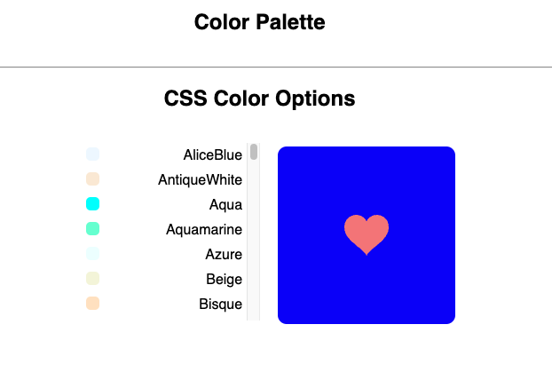

# Color Palette
The Color Palette app is a simple web application built with React JS.

## Project Background
The Color Palette app lets users make a list of their favorite colors by allowing them to scroll through a collection of colors, select which colors to add to their color palette, and delete colors from their palette.

The app was part of the course work for Skillcrush's "Introduction to JavaScript React" course. The focus in the Color Palette excercise was on "separation of concerns" and breaking down a user interface into components. 

During this excercise, I practiced: 

- Decomposing an image of a user interface (UI) into components so that each component has just one simple task to perform. 
- Importing and rendering presentational components with the props necessary to respond to user events. 

## Built with:
- React.js
- ES6 
- JSX
- CSS3
- HTML5

## Acknowledgements
**Skillcrush** - The app's HTML, CSS, and React files were provided by Skillcrush.  